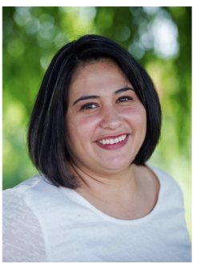

### PI Rosana Zenil-Ferguson

I joined the Department of Biology as an assistant professor on January 2019. I earned my PhD in evolutionary biology from University of Florida after completing a MSc in probability and statistics at CIMAT Mexico. My research aims to understand how often species traits evolve and how these traits change the speciation and extinction process across the tree of life. Using a combination of mathematics, statistics, and botany, I am currently studying the evolution of polyploidy and breeding systems, and whether these traits create opportunities for innovation and speciation in flowering plants.

### Contact
**Email**  roszenil@hawaii.edu

**Phone** (808) 956-8241

**Department of Biology**
Edmonson Hall 309
2538 McCarthy Mall
Honolulu, HI 96822

[**Google Scholar**](https://scholar.google.com/citations?hl=en&user=fddibuQAAAAJ&view_op=list_works&sortby=pubdate)

### Recent Publications
1. Rivero, R., Sessa, E.B. and Zenil‐Ferguson, R., 2019. EyeChrom and CCDBcurator: Visualizing chromosome count data from plants. Applications in Plant Sciences.
Undergrad research: [Visit Eyechrom website](https://www.eyechrom.com)

2.  Uyeda, J.C., Zenil-Ferguson, R. and Pennell, M.W., 2018.Rethinking phylogenetic comparative methods. Systematic Biology, 67(6), pp.1091-1109.
3.  Zenil‐Ferguson, R., Burleigh, J.G. and Ponciano, J.M., 2018. chromploid: An R package for chromosome number evolution across the plant tree of life. Applications in plant sciences, 6(3), p.e1037.

4. Landis, J.B., Bell, C.D., Hernandez, M., Zenil-Ferguson, R., McCarthy, E.W., Soltis, D.E. and Soltis, P.S., 2018. Evolution of floral traits and impact of reproductive mode on diversification in the phlox family (Polemoniaceae). Molecular phylogenetics and evolution, 127, pp.878-890.

### Commitment to Diversity and Inclusion
As a Latina, I have faced many challenges to become a scientist. Prejudices that range from "A woman can't do math" to "Mexicans are lazy" have always encouraged me to work harder and to become involved in social programs that promote scientific and cultural diversity.  These prejudices have taught me to work against socioeconomic, cultural, and gender biases that undermine the learning process of  underrepresented students in STEM.
It is not only supporting the activities from women and underrepresented minorities that we can achieve diversity. In my everyday work, I strive for educating students and colleagues of any background about implicit biases, stereotype threat, and impostor syndrome. I am convinced that by openly addressing diversity issues with our students and our colleagues we can promote inclusion beyond our labs while settling a precedent for other universities. My commitment to my students, collaborators, and colleagues is to continue creating a respectful and inclusive research environment where scientific creativity and cultural diversity is acknowledged and heard.

