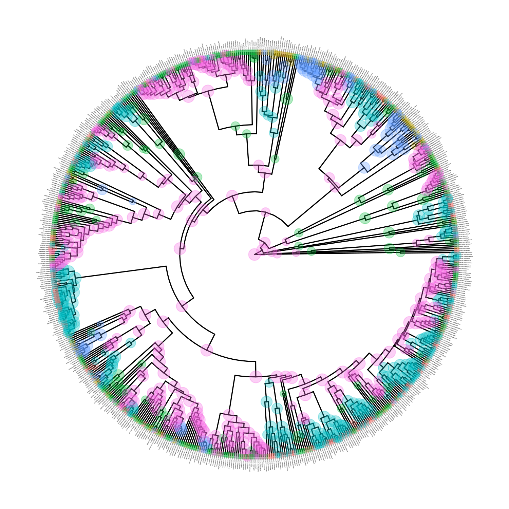

The Zenil-Ferguson lab at University of Hawai'i Mānoa develops new mathematical models and statistical tools to solve key questions of plant macroevolution. Our main focus is to understand how plant traits evolve and how those traits link to the diversification patterns observed in the plant tree of life.
