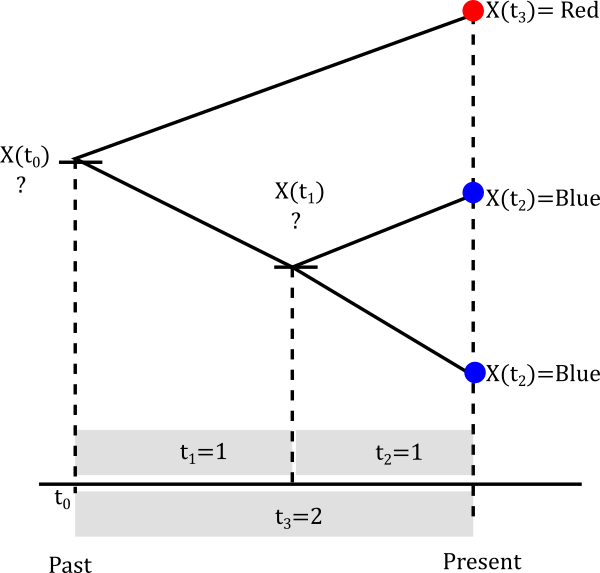
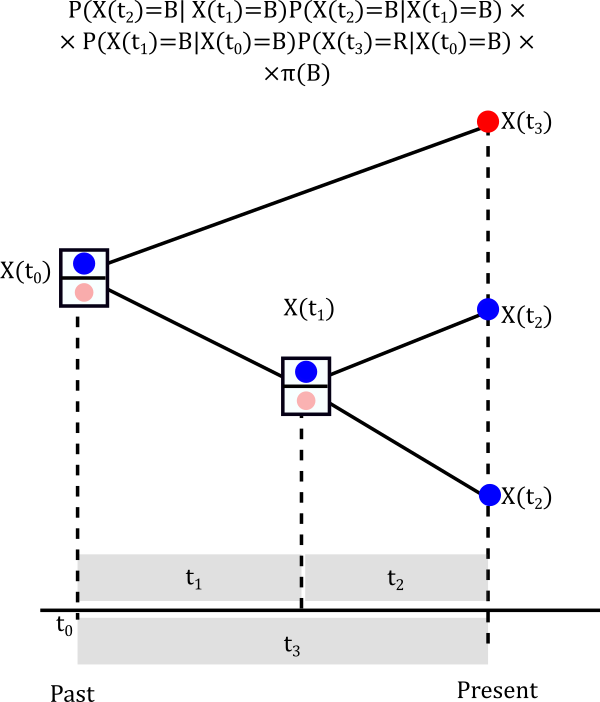
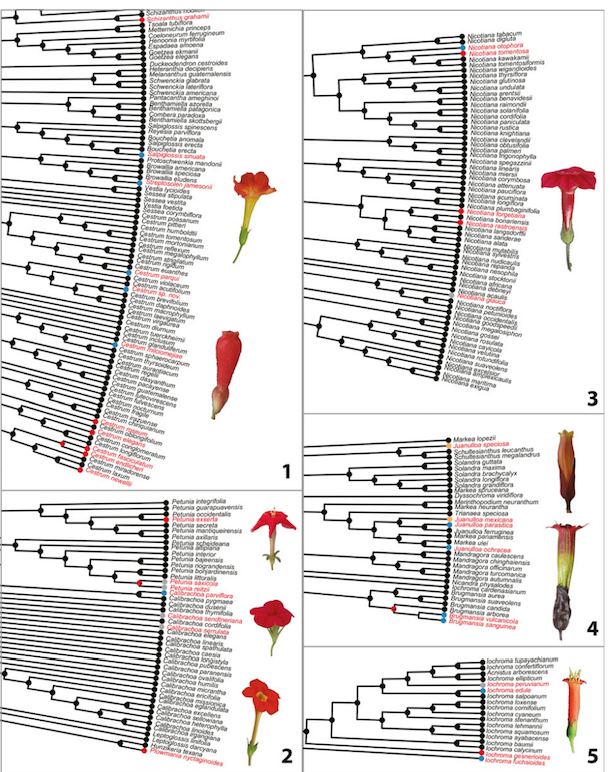
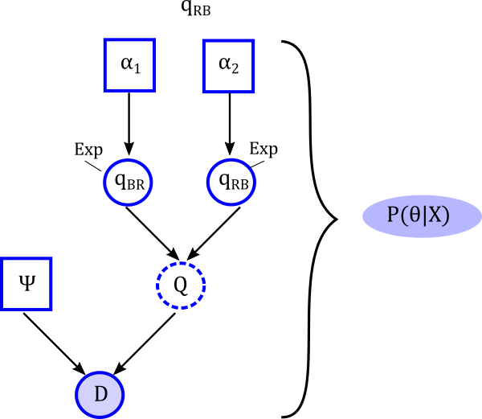

---
title: "CTMC"
author: Rosana Zenil-Ferguson

date: 2019-05-05

categories: teaching

header:

teaser: "ctmc_files/qmatrix.png"

header: "Lecture for midwest phylogenetics workshop 2019 about  continuous-time Markov chains"

og_image:"ctmc_files/qmatrix.png"

----

##  Continuous-Time Markov Chains (CTMC)

Continuous-time Markov chains (CTMC) are stochastic processes that allow us to follow the evolution of a trait(s) of interest. For example,
one might be interested in how flower color has evolved in a clade (blue to red) or how quickly a species  moved from region A to B.

CTMCs are usually denoted in mathematical notation as $$\{X(t), t\geq 0 \}$$; the stochastic process $X(t)$ follows flower color throughout time $$t$$. Time is continuous and it is measured using branch lengths. For discrete traits the process $X(t)$ takes values  in the natural numbers $$0,1,2,...$$.  CTMCs have many (cool) mathematical properties, but one of the most important  property is the Markovian property that states that  the probability distribution of future states of the process conditional on both past and present states) depends only upon the present state.


Mathematically, CTMC can be defined via stochastic equations (which will be super important when you are studying diversification methods) or via an infinitesimal probability matrix, better known as the Q-matrix.


### What is a Q-matrix?
In mathematics, the Q-matrix is the derivative of the probability matrix ($$P'(t)=P(t)Q$$). The  elements off the diagonal of the $$Q$$ matrix are transition rates and in the diagonal we have the negative sum of all the elemets of the row. The row adds to zero this is because probability matrices rows add to 1 so the derivative of the constant 1 is zero.

### Flower color evolution example
We are interested in following the evolution of flower color in a clade with only three taxa.  We propose a CTMC model to follow along how color has evolve in a clade of interest. We define our Q-matrix as follows


From blue to red evolution can happen with a rate $$\alpha$$ and from red to blue evolution happens with a rate $$\beta$$ What does this even mean? How do I interpret these rates?


To evolve from blue to red a lineage is expected to wait $$1/ \alpha$$ units of time so if $$\alpha$$ is large that means that the expected waiting time to evolve is fast. Time units come handy here, if they are millions of years we can start thinking about the average number of changes we expect to see in the tree and translate this into rates of the Q-matrix (useful for prior distribution elicitation).

### Based on these rates what is the probability that  a plant evolves from blue to red?

The rates in the Q-matrix is the derivative of the probability, so in general $$P(t)=e^{Qt}$$ (think about the exponential of a matrix for a second).

The general solution for the probabilities of the Q-matrix we proposed are


``` r
prob.mat<-function(alpha,beta,t){
exp.val<-exp(-(alpha+beta)*t)
probabilities<-1/(alpha+beta)*matrix(c(beta+alpha*exp.val, beta-beta*exp.val, alpha-alpha*exp.val, alpha+beta*exp.val),nrow=2)
return(probabilities)
}

(P.mat<- prob.mat(alpha=0.2, beta=0.3, t=1))
```

It looks ugly but what the matrix is saying is that in a time $$t$$ a flower will evolve from blue to red with probability $$P(X(t)=Red\|X(0)=Blue)=\frac{1}{\alpha+\beta}(\beta-\alpha e^{-(\alpha+\beta)t})$$.

Q-matrices can get really crazy!  Chromosome number matrices for example


So calculating the probabilities from algebra for large matrices is impossible so we use numerical approximations
``` r
#install.package("expm")
library("expm")
(Q.mat<-matrix(c(-0.2,0.3,0.2,-0.3), nrow=2))
(P.mat<-expm(Q.mat*1))
```
## Calculating the likelihood of a CTMC for discrete traits

We will be calculating the likelihood using the probability matrix above in this three-tip tree. The likelihood is not a straightforward calculation because our sample is not independent, the shared ancestry needs to be considered.



We are going to assume that our parameters are $$\alpha=0.2$$ and $$\beta=0.3$$. Calculating the likelihood of a non-independent sample is numerical intensive and you will get taste of this.

Let's start with the smallest clade


The internal node can be either Red or Blue but we really don't know.

Let's assume it is blue


The probablity of evolving from blue to blue is the (1,1) entry of the probablity matrix P(t). In mathematical terms $$P(X(t_2)=Blue \|X(t_1)=Blue)=P_{Blue \to Blue}(1)$$. This happens not only for one lineage but for both descendants of
the node so in reality we have to multiply that probability twice. So we can build a little table of both cases.


| If internal node is  $$X(t_1)=Blue$$                          | If internal node is $$X(t_ 1)=Red$$                            |
|:------------------------------------------:| :----------------------------------------:|
| $$[P(X(t_2)=Blue \|X(t_1)=Blue)]^2$$   | $$[P(X(t_2)=Blue \|X(t_1)=Red)]^2$$  |
| $$[P_{Blue \to Blue}(1)]^2=[e^{Q}]_{11}$$ |      $$[P_{Red \to Blue}(1)]^2=[e^Q]_{21}$$   |


The probabilities above are called conditional likelihoods (we are conditioning at each possible value of the internal node)  and we are going to store them for later use. Let's continue to assume that at the node the trait is blue, that is $$X(t_1)=Blue$$.
What is the probability that it actually happened to be blue?

Think about the possible pathways


+ Internal node is  $$X(t_1)=Blue$$  and root is  $$X(t_0)=Blue$$
+ Internal node is  $$X(t_1)=Blue$$  and root is  $$X(t_0)=Red$$


### Probabilities at the root
Finally, we need to think about the probability of the root being  Blue or Red

| Blue | Red |
|:----------------:| :---------------------:|
|$$\pi(Blue)$$ | $$\pi(Red)$$ |


So what are these probabilities? What would you write?


Interestingly, this is still an open question for discrete character evolution. In general people have done
+ Uniform probabilities $$\pi(Blue)=\pi(Red)=1/2$$
+ Weighted averages of likelihood. For example we fix our root to be Blue, calculate likelihood $$L_{Blueroot}$$, then we fix it to be Red calculate $$L_{Redroot}$$ and then the root is given probabilities $$(\pi(Blue),\pi(Red))=\Large(\frac{L_{Blueroot}}{L_{Blueroot}+L_{Redroot}},\frac{L_{Redroot}}{L_{Blueroot}+L_{Redroot}}\Large)$$
+ Stationary distribution
+ My new favorite the root probabilities are unknown and random varialbles and getting the posterior probabilities of the vector $$(\pi(Blue),\pi(Red))$$


Finally, the likelihood is the result of considering the probabilities all across the possible histories in the nodes of the tree.



###  Real examples
1. Ng, J. and Smith, S.D., 2016. Widespread flower color convergence in Solanaceae via alternate biochemical pathways. New Phytologist, 209(1), pp.407-417.

Figure 1. of Ng and Smith (2016)



2. Implementation in RevBayes for selfing and non-selfing taxa in Polimoneaceae
* [Data](https://github.com/phylosdd/MidwestPhylo2019/tree/master/docs/class/Discretetraitrevbayes/data)
* [RevCode](https://github.com/phylosdd/MidwestPhylo2019/blob/master/docs/class/Discretetraitrevbayes/mk2.Rev)



3. Chromploid package- Large Q-matrices


### References
+ Felsenstein, J., 1981. Evolutionary trees from DNA sequences: a maximum likelihood approach. Journal of molecular evolution, 17(6), pp.368-376.
+ Ng, J. and Smith, S.D., 2016. Widespread flower color convergence in Solanaceae via alternate biochemical pathways. New Phytologist, 209(1), pp.407-417.
+ Zenil‐Ferguson, R., Burleigh, J.G. and Ponciano, J.M., 2018. chromploid: An R package for chromosome number evolution across the plant tree of life. Applications in plant sciences, 6(3), p.e1037.
[chromploid R package](https://github.com/roszenil/chromploid)
+ Blackmon, H., Justison, J., Mayrose, I. and Goldberg, E.E., 2019. Meiotic drive shapes rates of karyotype evolution in mammals. Evolution, 73(3), pp.511-523.
 [chromePlus R package](https://github.com/coleoguy/chromePlus)
