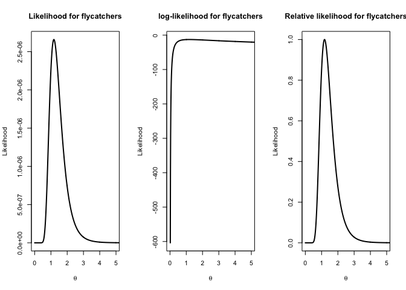
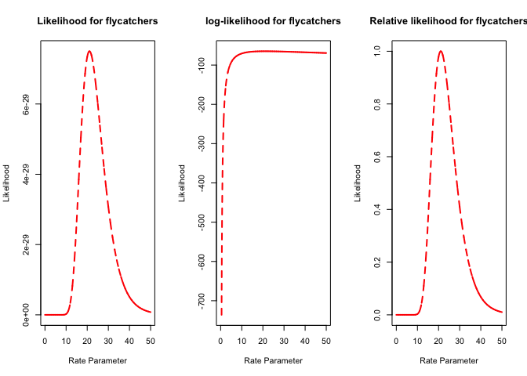
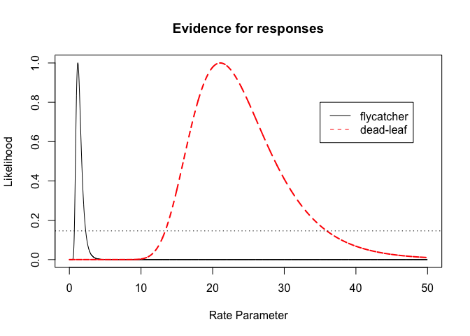

## Background


Ari Martinez spent multiple summers doing field work in the Peruvian
Amazonian. In 2011, Ari observed an interesting behavior in
heterospecific flocks. Depending on where on the forest a bird was
feeding its response would differ. For example if a bird is feeding on
the ground(dead-leaf gleaning) then the bird would “freeze” for some
time, but most of the flycatchers that feed on the top of the trees
wouldn’t even bother to stop.

Ari started timing the freezing behavior for some of these birds and was
able to collect a small sample. He would play an alarm call and then
measure the time birds were freezing depending on where they were
foraging.

This is his sample and you will be using it to understand evidence in
likelihood.

``` r
#Set your workind directory
#setwd(~/Dropbox/MidwestPhylo/)
bird.alarms<-read.csv("birdalarms.csv",stringsAsFactors=FALSE)
head(bird.alarms)
```


### The model

We are going to model freezing time using an exponential distribution
with parameter 1/*θ*, where *θ* is the expected time that birds of a
group freeze.

### The likelihood

As practiced before the likelihood function
$$L(θ; X) = f(X|θ)$$ is the product of the exponential density
evaluated in every value of the sample observed. In R we can code it
using the following function

``` r
likelihood.function<- function(parameter, observations){
probabilities <-dexp(observations, rate=1/parameter,log=FALSE)
L <- prod(probabilities)
return(-L)
}
```

Please note + Input of the likelihood function + Output of the
likelihood function (why is it negative?)

### A mini example with a sample size of two

If we have a sample size of two birds *X* = 2, 10 then we know based on
our calculations that the maximum likelihood estimate is the average
$$\hat{\theta}=\sum_{i=1}^n x_i/n$$. Therefore

``` r
mle<-(2+10)/2
```

However, most of the time in difficult likelihoods it is impossible to
calculate exactly who the mle so we do it numerically

``` r
(likelihood.optimization<-optimize(f=likelihood.function, interval=c(0,10), observations=c(2,10)))
```


The function `optimize` is used when we have unidimensional functions
(one parameter). For multidimensional we use `optim` or even better
`nloptr` from the package with the same name.

What are the outputs?

### The bird alarm example

In Ari’s example we have the dead-leaf gleaning species

``` r
dl.forager<- bird.alarms$Response[which(bird.alarms$Forage=="DL")]
```

and the flycatchers

``` r
f.forager<-bird.alarms$Response[which(bird.alarms$Forage=="F")] #11
```

#### Calculate the MLE for DL and F and the likelihood value evaluated at the MLE

You should be getting approximately the following values:

`mle.dl= 21.06248`

 `likelihoodval.dl=7.50118e-29`

`mle.f=1.181818`

`likelihoodval.f=2.658908e-06`

So, are the flycatchers behaving differently than the dead-leaf
gleaners? What is the evidence? Can we compare these likelihoods or
MLEs?

### Where is the evidence for different behavior?

Likelihood functions are not only about the maximum likelihood estimate.
Likelihoods represent plausibility. This is represented in the full
likelihood function so it is important to explore it.

We select a series of parameters and measure their plausibility for
example in the interval (0, 50)

``` r
parameter.vals<-seq(0.0001,50,0.01) #creating an interval for possible values for the likelihood
long<-length(parameter.vals)
# Evaluating the likelihood for each of those values
p.likelihoodf<-rep(0,long)
for (i in 1:long){
p.likelihoodf[i]<- -likelihood.function(parameter.vals[i],observations=f.forager) # Remeber is negative so we need to add a sign
}
```

In diffferent studies likelihood can be represented using different
scales

``` r
par(mfrow=c(1,3))
# Straight likelihood function
plot(parameter.vals, p.likelihoodf, type="l",main="Likelihood for flycatchers",xlab=expression(theta),ylab="Likelihood", lwd=2,xlim=c(0,5))


#log-likelihood function, most commonly used
plot(parameter.vals, log(p.likelihoodf), type="l",main="log-likelihood for flycatchers",xlab=expression(theta),ylab="Likelihood",lwd=2,xlim=c(0,5))

# Relative likelihood: Likelihood divided by the likelihood value at the MLE
plot(parameter.vals, p.likelihoodf/likelihoodval.f, type="l",main="Relative likelihood for flycatchers",xlab=expression(theta),ylab="Likelihood",lwd=2,xlim=c(0,5))
```



What do you think about the sample size for flycatchers?

#### Plot the likelihood for dead-leaf gleaners
``` r
p.likelihooddl<-rep(0,long)
for (i in 1:long){
p.likelihooddl[i]<- -likelihood.function(parameter.vals[i],observations=dl.forager)
}

par(mfrow=c(1,3))
plot(parameter.vals, p.likelihooddl, type="l",main="Likelihood for flycatchers",xlab="Rate Parameter",ylab="Likelihood",lty=2,col="red",lwd=2)

plot(parameter.vals, log(p.likelihooddl), type="l",main="log-likelihood for flycatchers",xlab="Rate Parameter",ylab="Likelihood",lty=2,col="red",lwd=2)

plot(parameter.vals, p.likelihooddl/likelihoodval.dl, type="l",main="Relative likelihood for flycatchers",xlab="Rate Parameter",ylab="Likelihood",lty=2,col="red",lwd=2)
```


It should look like this



### Are the freezing times different for the two groups?

Usually you will go ahead and do some statistical test to say “I reject
that the average freezing time of the groups is the same”. Except that
you can’t do a T-test (not normal), sample sizes are really small (so
not so much power). The evidence of likelihood comes to the rescue.

Using relative likelihoods we can compare the evidence between the two
groups

``` r
plot(parameter.vals, p.likelihoodf/likelihoodval.f, type="l",main="Evidence for responses",xlab="Rate Parameter",ylab="Likelihood")
lines(parameter.vals, p.likelihooddl/likelihoodval.dl,lty=2,col="red",lwd=2)
legend(x=35,y=0.8, col=c("black","red"),legend=c("flycatcher","dead-leaf"),lty=1:2)
```


### Likelihood intervals
One very neat mathematical result
(asymptotic) of using relative likelihoods is that we can cut the
likelihood at 14.6% plausibility and we obtain likelihood intervals
(with a large sample they become likelihood- 95%confidence inteval).

``` r
plot(parameter.vals, p.likelihoodf/likelihoodval.f, type="l",main="Evidence for responses",xlab="Rate Parameter",ylab="Likelihood")
lines(parameter.vals, p.likelihooddl/likelihoodval.dl,lty=2,col="red",lwd=2)
legend(x=35,y=0.8, col=c("black","red"),legend=c("flycatcher","dead-leaf"),lty=1:2)
abline(h=0.146,lty=3)
```



### Likelihood ratio test
If reviewers  knew more about evidential statistics they would be happy with the plot above. But Ari’s reviewers were
trained in frequentist statistics so a good compromise is to use a
likelihood ratio test. The statistic *L**R**T* for likelihood ratio test
is calculated as
*L**R**T* =  − 2(*l**o**g**L*(*H*<sub>0</sub>) − *l**o**g**L*(*H*<sub>1</sub>))

What is the null hypothesis*H*<sub>0</sub> and the alternative
hypothesis *H*<sub>1</sub> in this framework? Can you calculate it using
the `likelihood.function` and the maximum likelihood values that we
defined above?

For the null hypothesis
*H*<sub>0</sub>

``` r
mle.H0<-mean(c(dl.forager,f.forager))
loglike.H0<- log(-likelihood.function(parameter=mle.H0,observations=c(dl.forager,f.forager)))
```

Calculate the negative log-likelihood for the alternative hypothesis
(You should obtain approximately)
``` r
(loglike.H1<-log(likelihoodval.f*likelihoodval.dl))
 -77.5975
```

Then the LRT statistic is and its p-value from a *χ*<sup>2</sup>
distribution with degrees of freedom 2 parameters from *H*<sub>1</sub>
minus 1 parameter of *H*<sub>0</sub>

``` r
(LRT<- -2*(loglike.H0-loglike.H1))
```

`37.1582`

``` r
(p.value<-pchisq(LRT,df=1,lower.tail=FALSE))
```
`1.08924e-09`


1. Martínez, A.E. and Zenil, R.T., 2012. Foraging guild influences dependence on heterospecific alarm calls in Amazonian bird flocks. Behavioral Ecology, 23(3), pp.544-550.

2. Strug, L.J., 2018. The evidential statistical paradigm in genetics. Genetic epidemiology, 42(7), pp.590-607.


